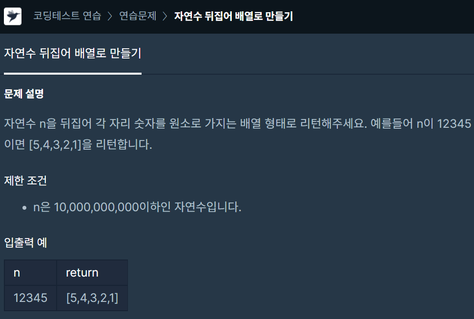

# 자연수 뒤집어 배열로 만들기

---



자연수 n을 뒤집고 각 자리 숫자를 배열로 리턴하는 문제다

---

## 풀이방법

1. 뒤집기  
   뒤집는 방법은 String으로 만들어서  
   [String 뒤집기](https://github.com/abhidhamma-java/TIL/blob/main/algorithm/유형/문자열/String_뒤집기.md)를 이용했다

2. 배열에 넣기  
   배열에 넣는 방법은 String을 char로 바꿔서  
   [int와 char를 서로 변환하기](https://github.com/abhidhamma-java/TIL/blob/main/algorithm/유형/문자열/int와_char를_서로_변환하기.md)를 이용했다

---

## 코드

```java
import java.util.stream.*;
import java.util.*;

class Solution {
    public int[] solution(long n) {
        int[] answer = {};

        String s = String.valueOf(n);
        int length = s.length();

        //뒤집기
        String reverse = "";
        for(int i=length-1; i>=0; i--) {
            reverse += s.charAt(i);
        }

        //배열에 넣기
        answer = new int[length];
        for(int i=0; i<length; i++) {
            int ctoi = Integer.parseInt(String.valueOf(reverse.charAt(i)));
            answer[i] = ctoi;
        }

        return answer;
    }
}
```
