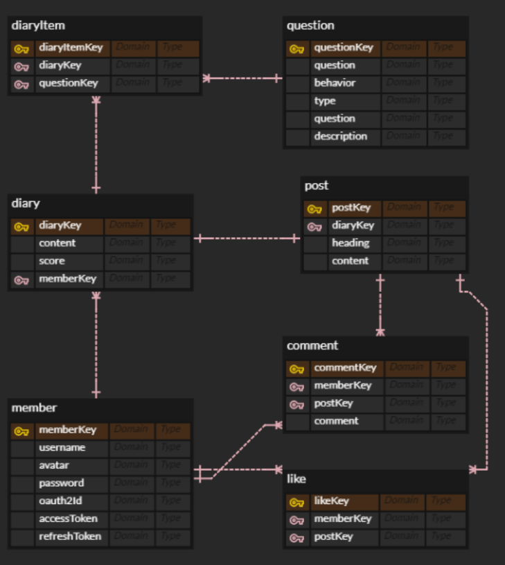

# selfhelp

## [프로젝트 웹 IDE에서 열어보기](https://github1s.com/abhidhamma-java/selfhelp)

---

구축한 보일러플레이트로
CRUD를 만드는 프로젝트를 진행해 보기로 했다.
아래는 프로젝트를 진행하면서 느낀점을 기술해 보았다.

## DB설계

유저가 question을 통해서 diary를 쓴다.  
쓴 diary는 post로 발행할 수 있고  
발행된 post에는 like와 comment가 달릴 수 있다.

다대다 관계의 경우에는  
두 관계 사이에 컬럼이 들어갈 가능성이 높으므로  
관계테이블을 꼭 만드는것이 유연한 db를 만들 수 있다.

## 폴더구조

- controller
  - API의 요청과 응답을 담당
- domain
  - DB구조를 entity로 표현
- dto
  - 요청과 응답을 담을 dto
- service
  - 비즈니스로직을 조합해 의미있는 단위의 서비스를 만들어 controller에 공급한다
- repository
  - datasource역할을 한다 DB와 직접적으로 바인딩되는 비즈니스로직
- etc
  - security설정 및 intercepter filter등

## API를 만들때 주의해야 할것

- DB구조 변경시 API스펙이 바뀌므로 프로그램의 유연성을 위해 엔티티를 외부에 노출하지 않도록 DTO로 쿼리를 받고 리턴한다.

- SELECT - API의 성능이 가장 많이 좌우되는 만큼 N+1문제를 고려하고, FetchType을 Lazy로 두고, 되도록이면 fetch join을 사용하고, 컬렉션 조회를 하기보다는 되도록이면 flat하게 쿼리를 받을 수 있도록 하는등 쿼리의 횟수를 줄일 수 있도록 생각을 많이 해본다.
- INSERT - cascade옵션을 주의깊게 살펴본다 필요한 부분에 설정이 안되어 있으면 관계테이블에 값이 안들어갈 수 있다.
- UPDATE - 벌크연산일때 영속성컨텍스트와 싱크가 안맞을 수 있는 부분 꼭 체크하고 @Modifying 어노테이션을 잘 사용하자.
- DELETE - isDeleted 컬럼을 쓸수는 있다 하지만 이것을 사용하면 거의 모든 select쿼리에 where절이 붙어야 하고 데이터베이스의 양이 커지면 느려지고 db가 보기 불편해질 수 있으므로 archive테이블을 따로 만들어서 관리하자.
